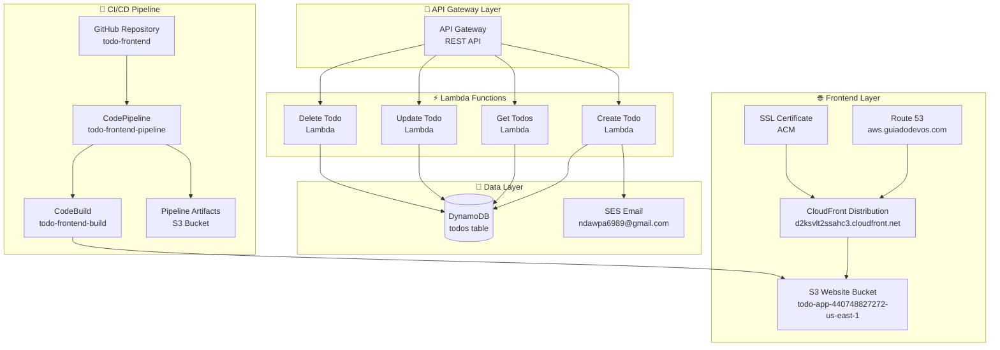

# 🏗️ AWS Serverless Todo Application - Architecture Diagram

## 📊 High-Level Architecture



## 🏢 Detailed Component Architecture

### **🌐 Frontend Infrastructure**
```
┌─────────────────────────────────────────────────────────────┐
│                    Frontend Layer                           │
├─────────────────────────────────────────────────────────────┤
│  Route 53 (DNS)                                             │
│  ├── aws.guiadodevos.com                                    │
│  └── todo.aws.guiadodevos.com (A Record)                   │
│                                                             │
│  CloudFront Distribution                                    │
│  ├── Domain: d2ksvlt2ssahc3.cloudfront.net                 │
│  ├── SSL Certificate: ACM                                  │
│  ├── Origin: S3 Bucket                                      │
│  └── Cache Policy: CACHING_OPTIMIZED                       │
│                                                             │
│  S3 Website Bucket                                          │
│  ├── Name: todo-app-440748827272-us-east-1                 │
│  ├── Website Hosting: Enabled                              │
│  ├── Public Access: Enabled                                │
│  └── CORS: Configured                                      │
└─────────────────────────────────────────────────────────────┘
```

### **🔌 API Infrastructure**
```
┌─────────────────────────────────────────────────────────────┐
│                    API Gateway Layer                        │
├─────────────────────────────────────────────────────────────┤
│  REST API                                                   │
│  ├── Base URL: https://[api-id].execute-api.us-east-1.amazonaws.com/prod │
│  ├── CORS: Enabled                                         │
│  └── Endpoints:                                            │
│      ├── GET /todos (List all todos)                       │
│      ├── POST /todos (Create todo)                         │
│      ├── GET /todos/{id} (Get specific todo)               │
│      ├── PUT /todos/{id} (Update todo)                     │
│      └── DELETE /todos/{id} (Delete todo)                  │
└─────────────────────────────────────────────────────────────┘
```

### **⚡ Lambda Functions**
```
┌─────────────────────────────────────────────────────────────┐
│                    Lambda Functions                         │
├─────────────────────────────────────────────────────────────┤
│  Common Configuration:                                      │
│  ├── Runtime: Node.js 16.x                                 │
│  ├── Memory: 128 MB                                        │
│  ├── Timeout: 3 seconds                                    │
│  └── Role: LambdaExecutionRole                             │
│                                                             │
│  Functions:                                                 │
│  ├── create-todo                                           │
│  │   ├── DynamoDB: PutItem                                 │
│  │   └── SES: SendEmail                                    │
│  ├── get-todos                                             │
│  │   └── DynamoDB: Scan                                    │
│  ├── update-todo                                           │
│  │   └── DynamoDB: UpdateItem                              │
│  └── delete-todo                                           │
│      └── DynamoDB: DeleteItem                              │
└─────────────────────────────────────────────────────────────┘
```

### **💾 Data Layer**
```
┌─────────────────────────────────────────────────────────────┐
│                    Data Layer                               │
├─────────────────────────────────────────────────────────────┤
│  DynamoDB Table: todos                                      │
│  ├── Partition Key: id (String)                            │
│  ├── Billing: PAY_PER_REQUEST                              │
│  ├── Removal Policy: DESTROY                               │
│  └── Auto Scaling: Enabled                                 │
│                                                             │
│  SES Email Identity                                         │
│  ├── Email: ndawpa6989@gmail.com                           │
│  ├── Verification: Required                                │
│  └── Usage: Todo notifications                             │
└─────────────────────────────────────────────────────────────┘
```

### **🔄 CI/CD Pipeline**
```
┌─────────────────────────────────────────────────────────────┐
│                    CI/CD Pipeline                           │
├─────────────────────────────────────────────────────────────┤
│  Source Stage:                                              │
│  ├── GitHub Repository: todo-frontend                      │
│  ├── Branch: main                                          │
│  └── Trigger: Code changes                                 │
│                                                             │
│  Build Stage:                                               │
│  ├── CodeBuild Project: todo-frontend-build                │
│  ├── Build Image: STANDARD_7_0                             │
│  ├── Node.js Version: 18                                   │
│  └── Build Commands:                                       │
│      ├── npm ci                                            │
│      ├── npm run build                                     │
│      ├── aws s3 sync dist/ s3://website-bucket             │
│      └── aws cloudfront create-invalidation                │
│                                                             │
│  Deploy Stage:                                              │
│  ├── S3 Deploy Action                                      │
│  └── CloudFront Invalidation                               │
└─────────────────────────────────────────────────────────────┘
```

## 🔐 Security & Permissions

### **IAM Roles & Policies**
```
┌─────────────────────────────────────────────────────────────┐
│                    Security Layer                           │
├─────────────────────────────────────────────────────────────┤
│  Lambda Execution Role:                                     │
│  ├── AWSLambdaBasicExecutionRole                           │
│  ├── DynamoDB: Read/Write access to todos table            │
│  └── SES: SendEmail permissions                            │
│                                                             │
│  CodeBuild Role:                                            │
│  ├── S3: Read/Write to website bucket                      │
│  └── CloudFront: CreateInvalidation                        │
│                                                             │
│  CloudFront Origin Access Identity:                        │
│  └── S3: Read access to website bucket                     │
└─────────────────────────────────────────────────────────────┘
```

## 🌍 Network & DNS

### **Domain Configuration**
```
┌─────────────────────────────────────────────────────────────┐
│                    Domain Setup                             │
├─────────────────────────────────────────────────────────────┤
│  Primary Domain: aws.guiadodevos.com                       │
│  Subdomain: todo                                           │
│  Full URL: https://todo.aws.guiadodevos.com                │
│                                                             │
│  DNS Configuration:                                         │
│  ├── Route 53 Hosted Zone                                  │
│  ├── A Record → CloudFront                                 │
│  └── SSL Certificate (ACM)                                 │
└─────────────────────────────────────────────────────────────┘
```

## 📈 Cost Optimization

### **Cost-Saving Features**
```
┌─────────────────────────────────────────────────────────────┐
│                    Cost Optimization                        │
├─────────────────────────────────────────────────────────────┤
│  DynamoDB:                                                  │
│  ├── PAY_PER_REQUEST billing                               │
│  └── No provisioned capacity                                │
│                                                             │
│  Lambda:                                                    │
│  ├── 128 MB memory (minimum)                               │
│  ├── 3-second timeout                                      │
│  └── Pay-per-execution                                     │
│                                                             │
│  CloudFront:                                                │
│  ├── Global caching                                         │
│  └── Reduced origin requests                               │
│                                                             │
│  S3:                                                        │
│  ├── Standard storage class                                │
│  └── Lifecycle policies (if needed)                        │
└─────────────────────────────────────────────────────────────┘
```

## 🚀 Deployment Flow

```
1. Code Push → GitHub
   ↓
2. CodePipeline Triggered
   ↓
3. CodeBuild Builds Frontend
   ↓
4. S3 Sync (Deploy to Website Bucket)
   ↓
5. CloudFront Cache Invalidation
   ↓
6. Live Website Updated
```

## 📊 Monitoring & Logging

### **Observability Stack**
```
┌─────────────────────────────────────────────────────────────┐
│                    Monitoring                               │
├─────────────────────────────────────────────────────────────┤
│  CloudWatch Logs:                                           │
│  ├── Lambda function logs                                  │
│  ├── API Gateway access logs                               │
│  └── CodeBuild build logs                                  │
│                                                             │
│  CloudWatch Metrics:                                        │
│  ├── Lambda invocations & errors                           │
│  ├── DynamoDB read/write capacity                          │
│  ├── API Gateway requests                                  │
│  └── CloudFront requests                                   │
│                                                             │
│  CloudWatch Alarms:                                         │
│  ├── Lambda errors > threshold                             │
│  ├── API Gateway 5xx errors                                │
│  └── DynamoDB throttling                                   │
└─────────────────────────────────────────────────────────────┘
```

## 🔧 Infrastructure as Code

### **CDK Stack Structure**
```
TodoInfrastructureStack
├── Data Layer
│   ├── TodoTable (DynamoDB)
│   └── TodoEmailIdentity (SES)
├── Compute Layer
│   ├── LambdaExecutionRole (IAM)
│   ├── CreateTodoFunction (Lambda)
│   ├── GetTodosFunction (Lambda)
│   ├── UpdateTodoFunction (Lambda)
│   └── DeleteTodoFunction (Lambda)
├── API Layer
│   └── TodoApi (API Gateway)
├── Frontend Layer
│   ├── TodoWebsiteBucket (S3)
│   ├── OriginAccessIdentity (CloudFront)
│   ├── TodoHostedZone (Route 53)
│   ├── TodoCertificate (ACM)
│   └── TodoDistribution (CloudFront)
└── CI/CD Layer
    ├── PipelineArtifactBucket (S3)
    ├── FrontendBuildProject (CodeBuild)
    └── FrontendPipeline (CodePipeline)
```

This architecture provides a fully serverless, scalable, and cost-effective solution for the Todo application with automated CI/CD deployment. 