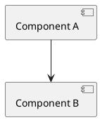
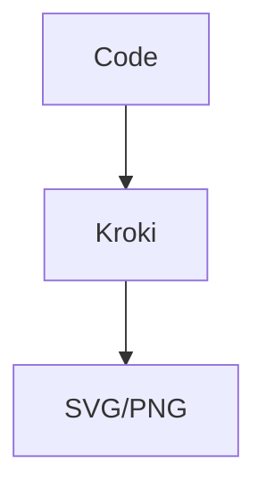
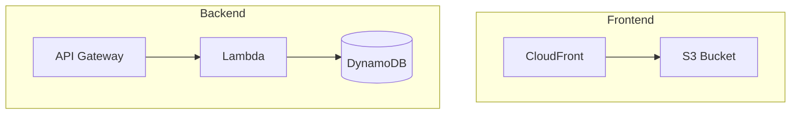
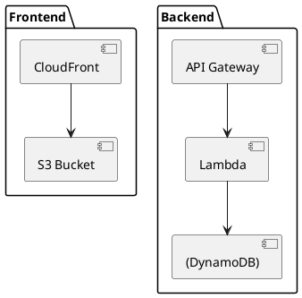

# 🎨 Diagram-as-Code Tools Comparison

## 📊 Popular Tools Overview

### **1. Mermaid** ⭐⭐⭐⭐⭐


**Pros:**
- ✅ Native GitHub support
- ✅ Simple syntax
- ✅ Great for flowcharts and architecture
- ✅ Free and open source
- ✅ VS Code extension available

**Cons:**
- ❌ Limited styling options
- ❌ Not great for complex UML diagrams

**Best for:** Flowcharts, sequence diagrams, architecture diagrams

---

### **2. PlantUML** ⭐⭐⭐⭐⭐


**Pros:**
- ✅ Very powerful and flexible
- ✅ Excellent UML support
- ✅ Multiple diagram types
- ✅ Great for complex architectures
- ✅ C4 model support

**Cons:**
- ❌ Steeper learning curve
- ❌ Requires Java runtime
- ❌ More verbose syntax

**Best for:** System architecture, UML diagrams, C4 models

---

### **3. C4 Model** ⭐⭐⭐⭐⭐
```plantuml
@startuml C4_Context
!include https://raw.githubusercontent.com/plantuml-stdlib/C4-PlantUML/master/C4_Context.puml
Person(user, "User", "A user of the system")
System(system, "System", "The system being built")
Rel(user, system, "Uses")
@enduml
```

**Pros:**
- ✅ Industry standard for software architecture
- ✅ Multiple abstraction levels
- ✅ Clear and consistent notation
- ✅ Great for documentation

**Cons:**
- ❌ Requires understanding of C4 concepts
- ❌ Can be complex for simple diagrams

**Best for:** Software architecture documentation, system design

---

### **4. Structurizr** ⭐⭐⭐⭐
```json
{
  "name": "System",
  "containers": [
    {
      "id": "webapp",
      "name": "Web Application",
      "technology": "React"
    }
  ]
}
```

**Pros:**
- ✅ C4 model support
- ✅ JSON/YAML configuration
- ✅ Multiple views (context, container, component)
- ✅ Good for large systems

**Cons:**
- ❌ Requires Structurizr tool
- ❌ More complex setup
- ❌ Less flexible than PlantUML

**Best for:** Large system architecture, C4 model implementation

---

### **5. Draw.io (Diagrams.net)** ⭐⭐⭐⭐
```xml
<mxfile>
  <diagram id="diagram">
    <mxGraphModel>
      <!-- XML structure -->
    </mxGraphModel>
  </diagram>
</mxfile>
```

**Pros:**
- ✅ Visual editor available
- ✅ Very flexible
- ✅ AWS architecture templates
- ✅ Export to multiple formats

**Cons:**
- ❌ XML is verbose
- ❌ Not truly "as code"
- ❌ Harder to version control

**Best for:** Complex diagrams, AWS architecture, visual design

---

### **6. Kroki** ⭐⭐⭐


**Pros:**
- ✅ Multiple diagram types
- ✅ API-based rendering
- ✅ Good integration options

**Cons:**
- ❌ Requires external service
- ❌ Less popular than others

**Best for:** API-based diagram generation

---

## 🏆 **Recommendations by Use Case**

### **For Your AWS Infrastructure:**

1. **Mermaid** - Best overall choice
   - Simple syntax
   - GitHub native support
   - Perfect for architecture diagrams

2. **PlantUML with C4** - For detailed documentation
   - Professional appearance
   - C4 model standards
   - Multiple abstraction levels

3. **Structurizr** - For enterprise documentation
   - C4 model compliance
   - Multiple views
   - JSON configuration

### **Quick Start Guide:**

#### **Mermaid (Recommended)**


#### **PlantUML**


#### **C4 Context**
```plantuml
@startuml C4_Context
!include https://raw.githubusercontent.com/plantuml-stdlib/C4-PlantUML/master/C4_Context.puml
Person(user, "User", "Todo app user")
System(todoApp, "Todo Application", "Serverless todo app")
Rel(user, todoApp, "Uses")
@enduml
```

## 🛠️ **Tools & Extensions**

### **VS Code Extensions:**
- **Mermaid Preview** - Live preview of Mermaid diagrams
- **PlantUML** - PlantUML support
- **Draw.io Integration** - Draw.io diagrams in VS Code

### **Online Editors:**
- **Mermaid Live Editor** - https://mermaid.live
- **PlantUML Online** - http://www.plantuml.com/plantuml
- **Structurizr** - https://structurizr.com

### **GitHub Integration:**
- **Mermaid** - Native support in markdown
- **PlantUML** - Via GitHub Actions
- **C4** - Via PlantUML

## 🎯 **Final Recommendation**

For your AWS infrastructure project, I recommend:

1. **Start with Mermaid** - Simple, GitHub-native, perfect for architecture diagrams
2. **Use PlantUML with C4** - For professional documentation
3. **Consider Structurizr** - If you need enterprise-level documentation

The examples I created show how to represent your infrastructure using different tools. Choose based on your team's familiarity and documentation needs! 